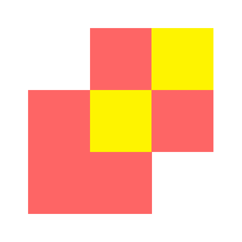

# Branding

This repo holds branding assets (i.e. logos) for Fyra Labs and our projects.
While the repo sources only contain SVGs, we have a workflow that generates PNG versions for convenience.
You can get these versions from the [latest build artifact](https://nightly.link/FyraLabs/branding/workflows/build/logos/derived.zip) or by building them yourself.

## 🛠️ Dependencies

Please make sure you have these dependencies first before building.

```bash
just
ImageMagick
```

## 🏗️ Building

Simply clone this repo, then:

```bash
just build
```

## 🖼️ Gallery

<details>
    <summary>Fyra Labs logos</summary>
    
    
    
    
    
</details>

<details>
    <summary>Fyra Labs Services logos</summary>
    
    
    
    
</details>

## 👋 Bye?

Goodbye!

<sub>Made with <3 by nekos at Fyra Labs~</sub>
